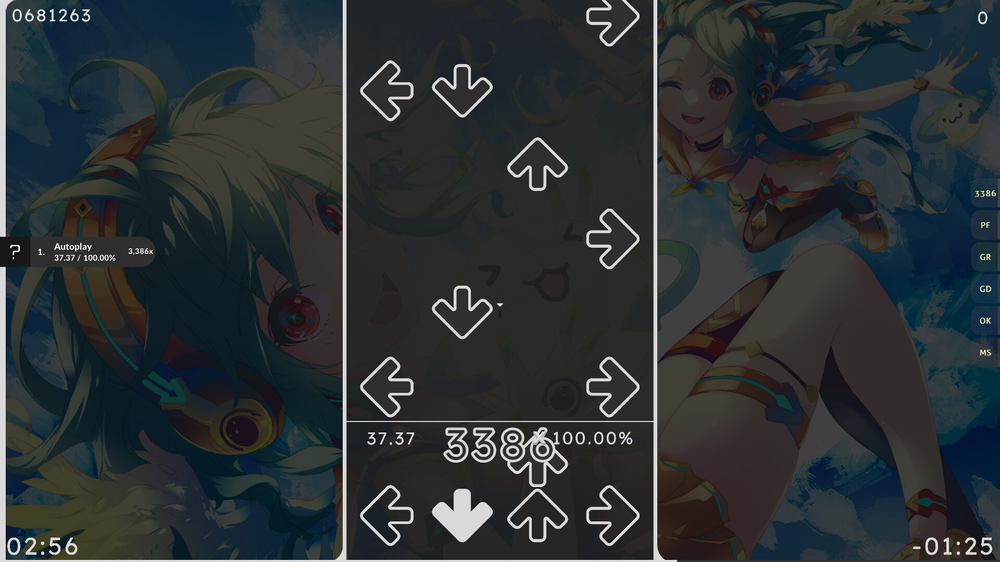
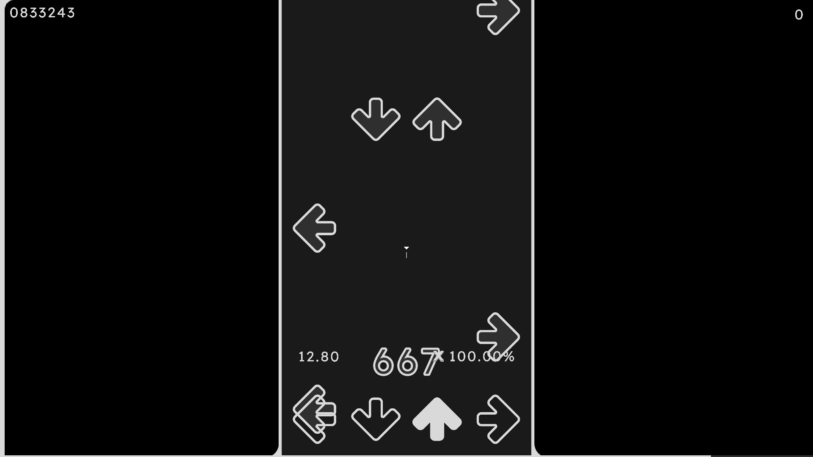
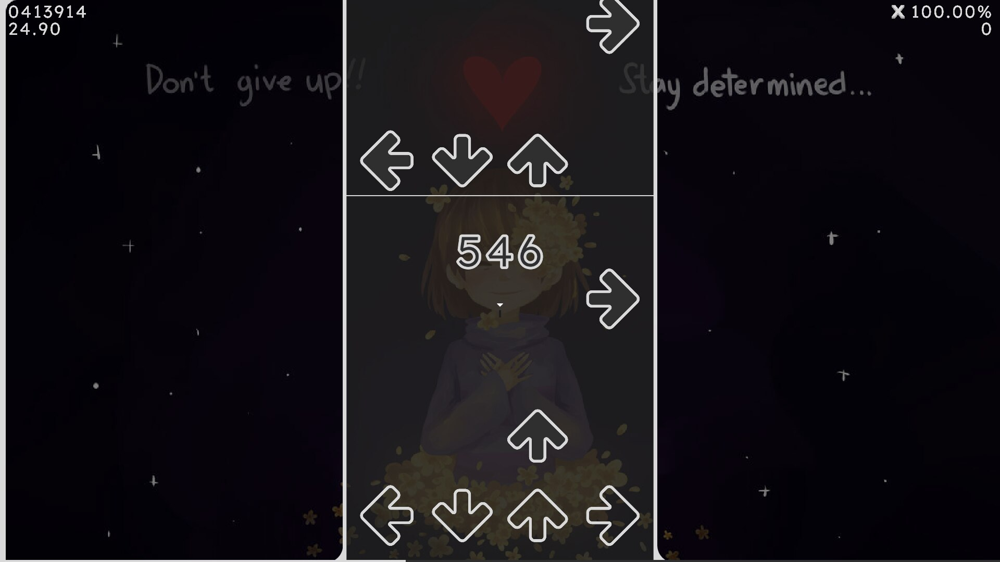
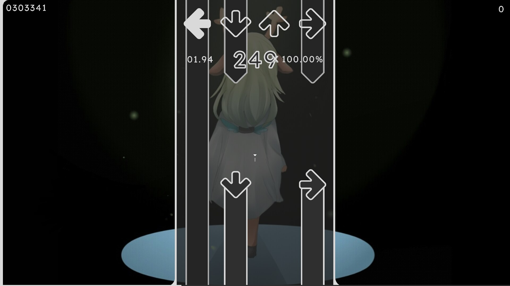

# Quixotic - Made with lots of `#2f2f2f` and `#d9d9d9`!
Oh, and love too, I guess.

The goal of this skin was to make a pleasing monochrome interface, that is also easy on the eyes and leaves little room for distractions.

I made this primarily in Figma, and you can check out the project [here](https://www.figma.com/design/1zG392vYEOZUBXJ2TOsZbr/Skins?node-id=0-1).

## Promo

 
 Screenshots 

 
 Video 

[YouTube](https://youtu.be/Z9gQknQgcj8)

...what? I can't embed videos larger than 10MB on here.

## Downloads
1. Steam (Stable) - [Workshop Page](https://steamcommunity.com/sharedfiles/filedetails/?id=3119237347)
2. GitHub (Nightly) - [Download ZIP](https://github.com/danatationn/Quixotic/archive/refs/heads/main.zip)

To install the nightly version, you'll need to extract the ZIP file into Quaver's skin folder.

You can find the skin folder by opening Quaver, going to the Skin settings, and hitting on the button next to the `Open Skin Folder` section.
It's also located at `(Steam path)/steamapps/common/Quaver/Skins/`.

## What's with all the skin.ini files?
Quixotic has multiple skin.ini files for multiple use cases!
To replace your skin.ini files just rename the current skin.ini to something else (e.g. "skin.ini.bak"), and then rename the one you want (e.g. "skin.upscroll.ini") to "skin.ini".

Here's a nice little chart:

|Filename				|Aspect Ratio	|Upscroll|
------------------------|---------------|---------
skin.downscroll.ini		|16:9/16:10		|No
skin.upscroll.ini		|16:9/16:10		|Yes
skin.universal.ini[^1]	|Any			|N/A

## Credits
* The background: [gnome-backgrounds](https://gitlab.gnome.org/GNOME/gnome-backgrounds/-/commit/02031a4013e46b4332ac2b407d81d8d11afa349e#5078144395a055a4e16c0170d768b42946126b54) (WHY WAS THIS REMOVED)

* The sounds:

|Renamed File Name[^2]	|File Name[^3]		|Project[^4]|
|-----------------------|-------------------|------------
sound-back				|menu-direct-click	|[PinkChoco](https://osu.ppy.sh/community/forums/topics/1153050)
sound-click				|menuhit			|[PinkChoco](https://osu.ppy.sh/community/forums/topics/1153050)
sound-combobreak		|combobreak			|[Ghost Rule](https://osu.ppy.sh/community/forums/topics/1792933)
sound-failure			|sectionfail		|[Ghost Rule](https://osu.ppy.sh/community/forums/topics/1792933)
sound-hit				|soft-hitnormal		|[Aesthetic](https://osu.ppy.sh/community/forums/topics/189843)
sound-hitclap			|soft-hitclap (2)	|[dokidokilolixx](https://osuskins.net/skin/KH69gJk)
sound-hitfinish			|soft-hitfinish2	|[dokidokilolixx](https://osuskins.net/skin/KH69gJk)
sound-hitwhistle		|normal-hitwhistle	|[PinkChoco](https://osu.ppy.sh/community/forums/topics/1153050)
sound-hover				|menu-direct-hover	|[PinkChoco](https://osu.ppy.sh/community/forums/topics/1153050)
sound-menu-keyclick-1	|key-press-1		|[PinkChoco](https://osu.ppy.sh/community/forums/topics/1153050)
sound-menu-keyclick-2	|key-press-2		|[PinkChoco](https://osu.ppy.sh/community/forums/topics/1153050)
sound-menu-keyclick-3	|key-press-3		|[PinkChoco](https://osu.ppy.sh/community/forums/topics/1153050)
sound-menu-keyclick-4	|key-press-4		|[PinkChoco](https://osu.ppy.sh/community/forums/topics/1153050)
sound-retry				|menuback			|[clearblack](https://osuskins.net/skin/lwteH8H)

## License
© [WTFPL](LICENSE.txt) where not otherwise specified.

Exceptions:

* The items listed in the Credits section are not covered by the WTFPL and retain their original licenses or copyrights as specified by their respective projects.  
* All other assets in this skin are licensed under the [WTFPL](https://www.wtfpl.net/) (link to their website).

[^1]: `skin.universal.ini` uses the default Quaver skin layout and was made basically just for people with weird monitors that don't adhear to any of the other configs.
[^2]: `Renamed Project Name` refers to the name of the file that you can find in the files of Quixotic
[^3]: `File Name` refers to the name of the file that you can find in the project in which the sound originated
[^4]: `Project` refers to the name of the project/skin which has the sound